# BiteBeyond

A **food ordering app** built as part of my learning journey in Android development.  
The app allows users to browse restaurants, explore menus, add food items to a cart, and place orders.  
I also experimented with integrating **AI-based food suggestions** for a personalized experience.  

---
## ✨ Features

- 🔑 User authentication (login / signup) or you can skip login/signup if you're just here to explore the app and may signup later if you liked. 
- 🍽️ Browse restaurants and their menus.  
- 🛒 Add items to cart & manage quantity.  
- 💸 Apply promo codes & calculate discounts.  
- 📍 Restaurant's distance indicator (in Km) based on your location. 
- 🤖 AI-powered food recommendations bases on time you have and cuisine you want. 
- 📦 Place and track current order and also see past orders.
- 🧑‍💼 Admin App for Restaurant owners to let them see pending and past orders, view and modify current menu, view past orders and change restaurant's information like image, description and address etc.

---

## 🛠️ Tech Stack

- **Language**: Kotlin  
- **Framework**: Jetpack Compose (UI)  
- **Architecture**: MVVM + Hilt (DI) for scalable application
- **Database**: Firebase Realtime Database & Room (local cart persistence)  
- **Payments**: Razorpay integration  
- **Other**: Navigation Components, Coroutines, LiveData / StateFlow

---

## 🚀 Getting Started

### Prerequisites
- Android Studio (latest version)  
- JDK 17  
- Firebase project setup (for Realtime DB & Authentication)

### Steps to Run
1. Clone the repository  
   ```bash
   git clone https://github.com/ChauhanAshu001/BiteBeyond.git
2. Open in Android Studio

3. Add your own google-services.json for Firebase

4. Sync Gradle & Run the app on an emulator / device

---

## 📸 Screenshots(User App)

<table>
  <tr>
    <td align="center">
      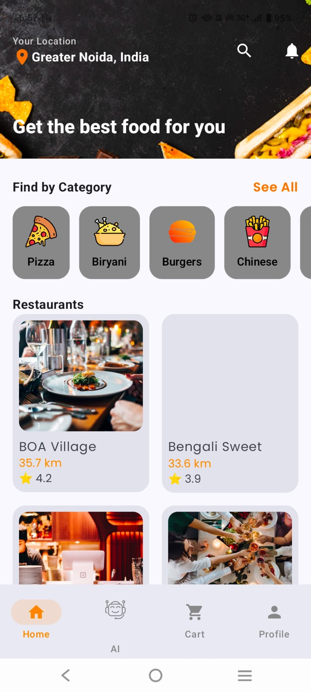<br/>
      <sub><b>Client App Home Screen</b></sub>
    </td>
    <td align="center">
      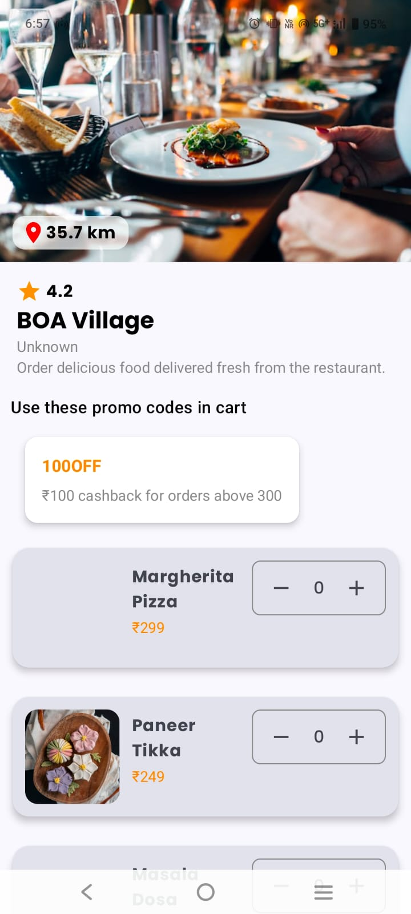<br/>
      <sub><b>Restaurant Details Screen</b></sub>
    </td>
    <td align="center">
      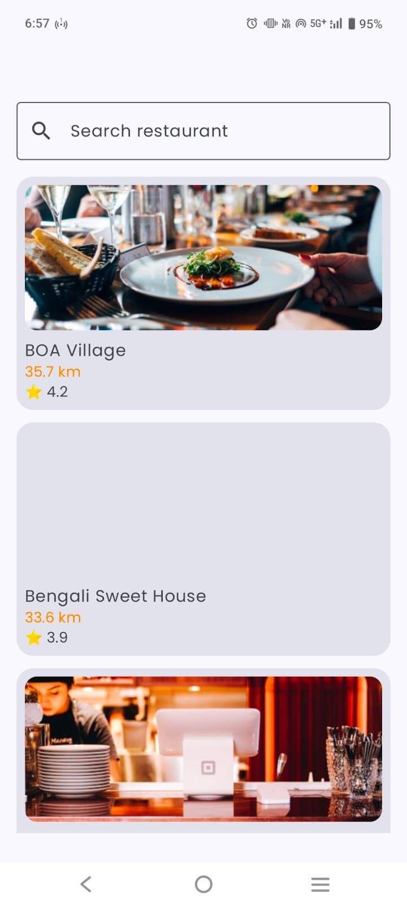<br/>
      <sub><b>Search Screen</b></sub>
    </td>
     <td align="center">
      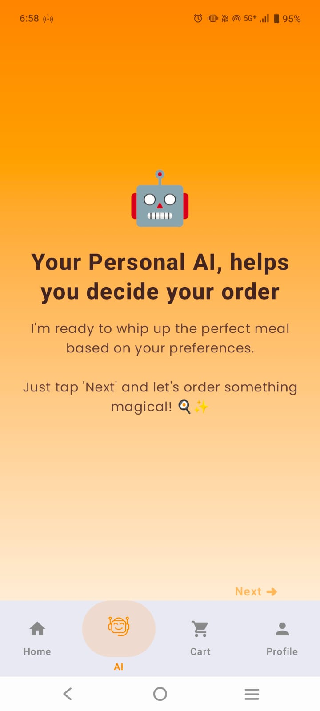<br/>
      <sub><b>AI</b></sub>
    </td>
  </tr>
   
  <tr>
   <td align="center">
      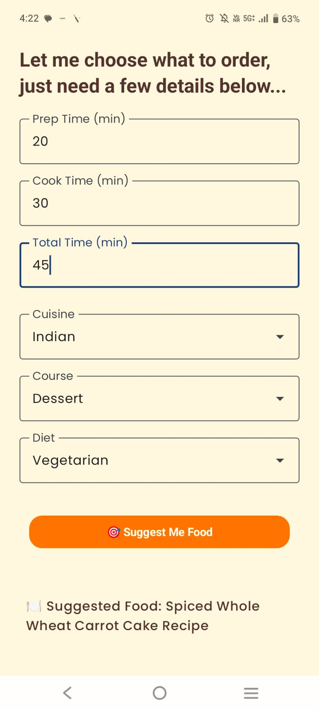<br/>
      <sub><b>AI model in action</b></sub>
   </td>
    <td align="center">
      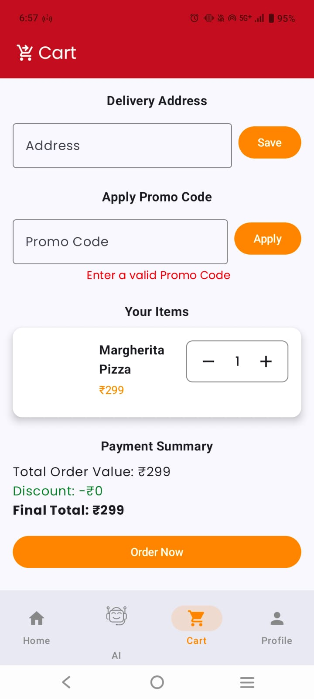<br/>
      <sub><b>Cart Screen</b></sub>
    </td>
    <td align="center">
      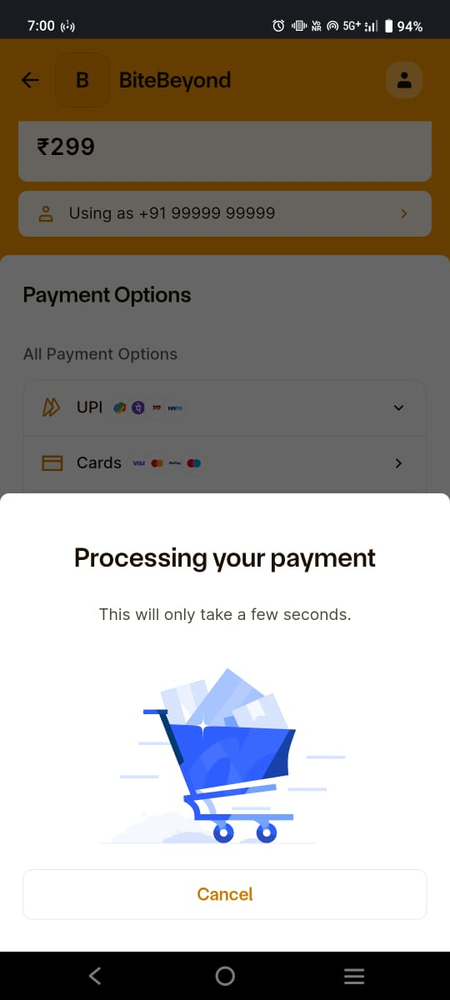<br/>
      <sub><b>Payment Screen</b></sub>
    </td>
    <td align="center">
      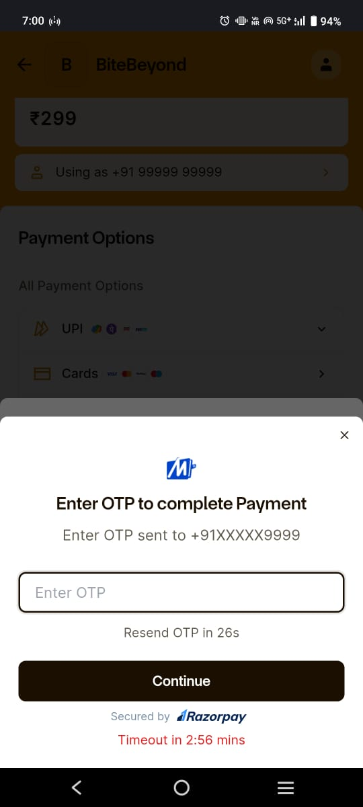<br/>
      <sub><b>Payment Screen 2</b></sub>
    </td>
  </tr>
   <tr>
   <td align="center">
      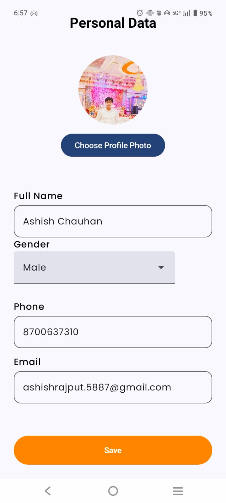<br/>
      <sub><b>Profile Screen</b></sub>
    </td>
    <td align="center">
      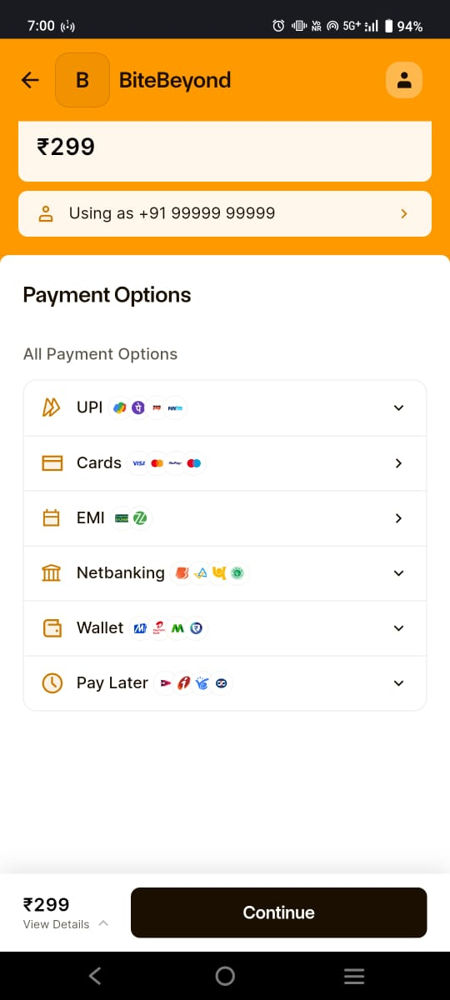<br/>
      <sub><b>Payment Options</b></sub>
    </td>
    <td align="center">
      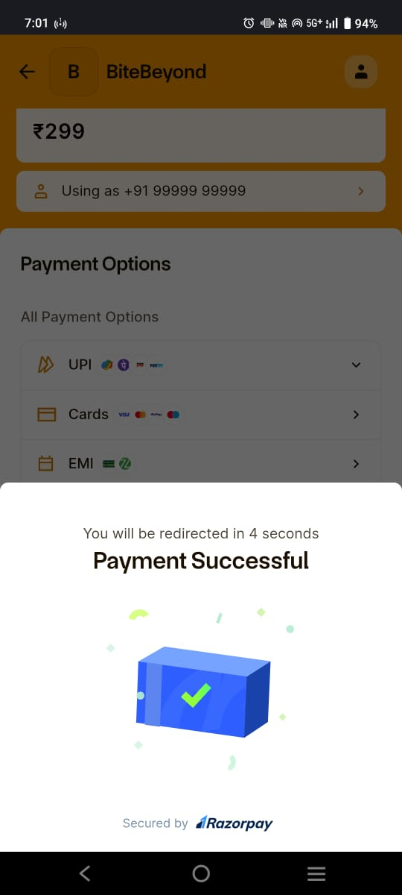<br/>
      <sub><b>Payment Successful</b></sub>
    </td>
   <td align="center">
      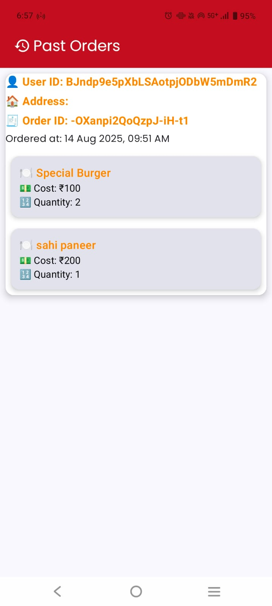<br/>
      <sub><b>Past Order Screen</b></sub>
    </td>
  </tr>
</table>

## 📸 Screenshots(Admin App)
<table>
  <tr>
    <td align="center">
      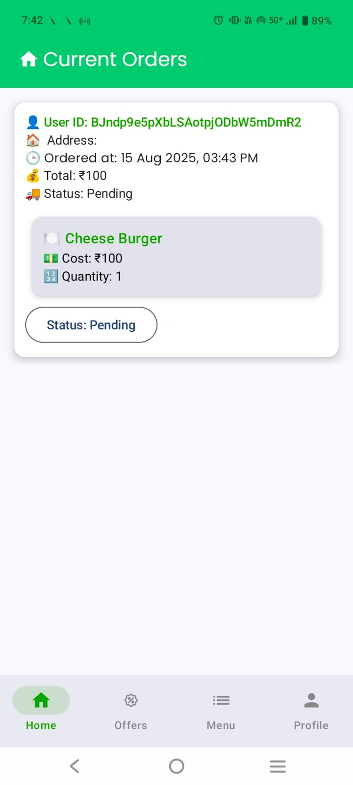<br/>
      <sub><b>Admin App Home Screen</b></sub>
    </td>
    <td align="center">
      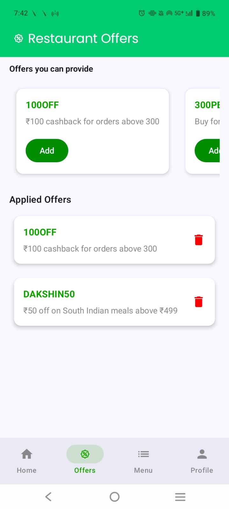<br/>
      <sub><b>Admin Offers Screen</b></sub>
    </td>
    <td align="center">
      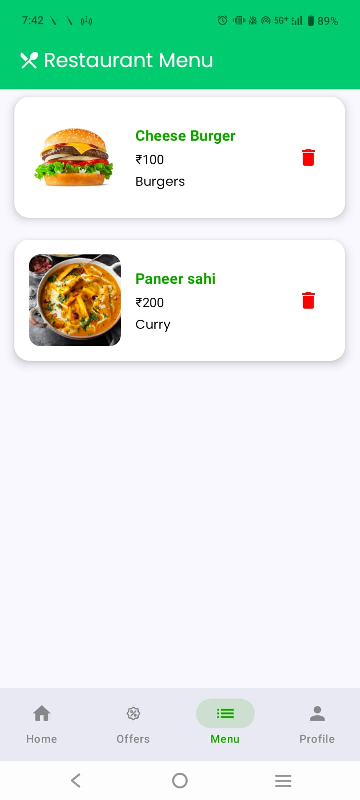<br/>
      <sub><b>Restaurant's Current Menu Screen</b></sub>
    </td>
   <td align="center">
      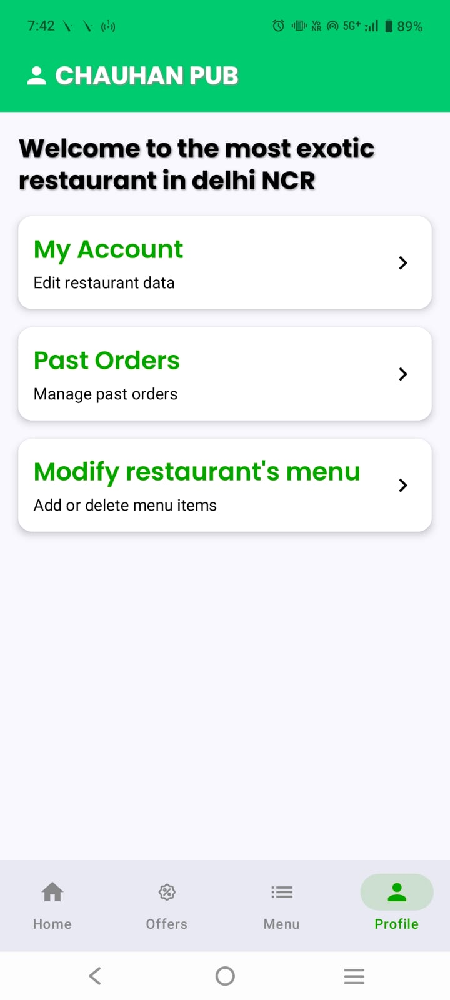<br/>
      <sub><b>Admin's Profile Screen</b></sub>
    </td>
  </tr>
</table>


### 📚 Learning Highlights

- Gained hands-on experience with Jetpack Compose

- Understood MVVM architecture & clean state management

- Worked with Firebase Realtime Database for dynamic data

- Implemented payment gateway integration

- Learned how to design a user-friendly onboarding & cart flow
---

### I’m Ashish Chauhan, I build apps to solve problems, and solve problems to build skill. Development and DSA — both on my terms.

📧 [ashishchauhan.4769@gmail.com]

💼 [www.linkedin.com/in/chauhanashish001]
